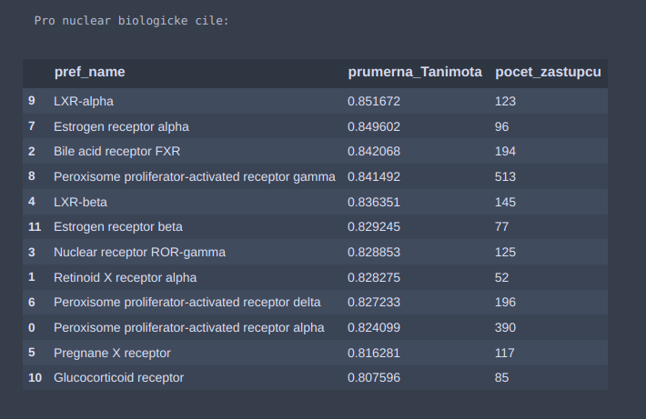
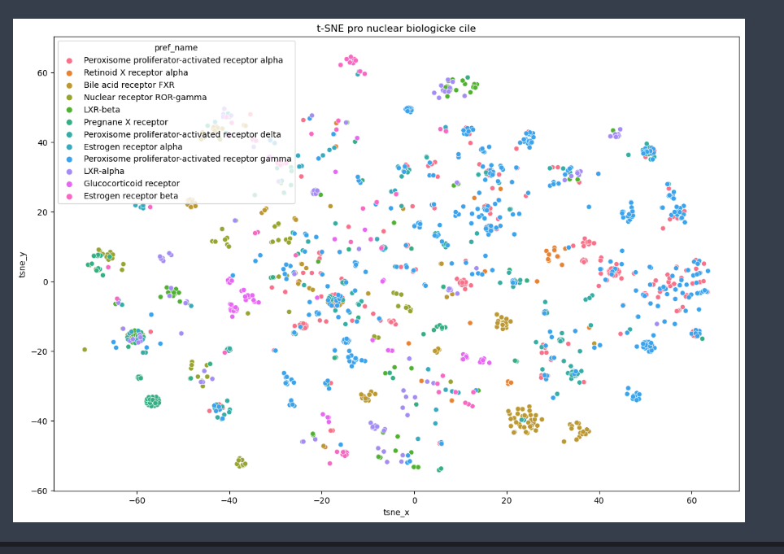
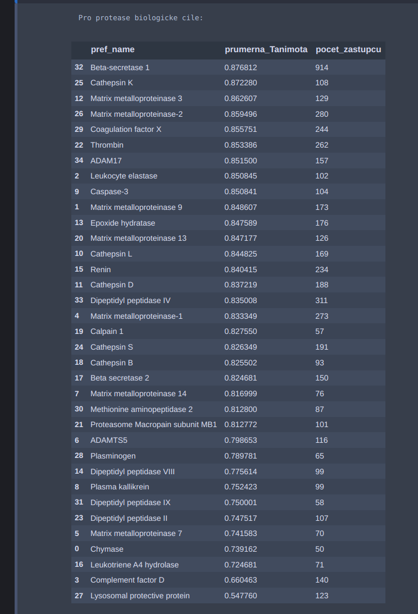
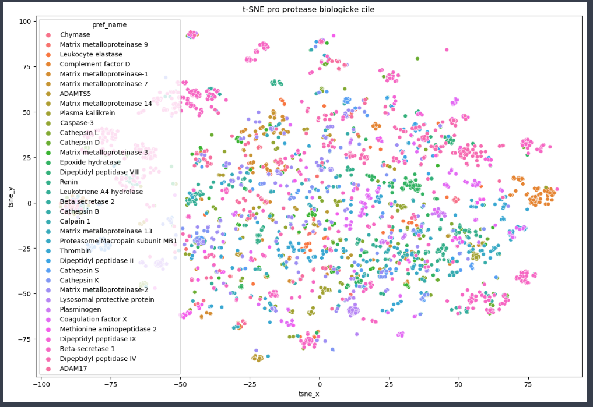

31.1.2023
* Vyber vhodneho biologickeho cile:
pomoci scriptu Wima byli vybrane nejprve targety pro jaderny receptor a pak nasledne byli stazene ligandy, ktere byli anotovane EC50 a pro ketre byla jejich standrardni typ '=' a standardni hodnota <500-1500> nM.
Pak byli byli jednotlive smiles prevedene na morganuv fingerprint r=3,  nBit = 2048, pro ktere byla spocitana tanimotova distance(distsimilarity) takze cimn vetsi hodnota tim je to lepsi. Nejprve byla spocitana tanimotova prumerna hodnota a zastoupeni jednotlivych trid a taky byla provedene shulkova anlyza pro vizualizaci jednotlivych ligandu.

+-------------------------------------------------+-----------+------+
| Jmeno receptoru:                                | Tanim.mean|Count |
+-------------------------------------------------+-----------+------+
| Glucocorticoid receptor	                      | 0.807596  |  85  | 
| Pregnane X receptor	                          | 0.816281  |  117 | 
| Peroxisome proliferator-activated receptor alpha| 0.824099  |  390 | 
| Peroxisome proliferator-activated receptor delta| 0.827233  |  196 | 
| Retinoid X receptor alpha	                      | 0.828275  |  52  |  
| Nuclear receptor ROR-gamma	                  | 0.828853  |  125 |  
| Estrogen receptor beta	                      | 0.829245  |  77  | 
| LXR-beta	                                      | 0.836351  |  145 |  
| Peroxisome proliferator-activated receptor gamma| 0.841492  |  513 |  
| Bile acid receptor FXR	                      | 0.842068  |  194 | 
| Estrogen receptor alpha	                      | 0.849602  |  96  | 
| LXR-alpha	                                      | 0.851672  |  123 |  
+-------------------------------------------------+-----------+------+

Podle me je nejlepsi volba LXR-alpha ma nejvic diverznejsi scaffodly a plus ma pomerny pocet ligandu.

l1 = "Other nuclear protein"
l2 = "Nuclear receptor"

Dalsim krokem bude prozkoumani dalsiho rodiny biologickych cilu a to jsou napriklad proteozomy.

- 1.2.2023
podle klasifikace je to 
l1 = 'enzym'
l2 = 'protease'

takze zahrneme jenom l2, protoze chceme jenom protease.
Podle vypoceitane prumerne hodnotu Tanimotove vdalenosti a poctu jednotlivych zastupcu, byl vybran Cathepsin K

+--------------------------------------+-----------+------+
|  pref_name                           Tanim.mean  count  |
+--------------------------------------+-----------+------+
|  Beta-secretase 1                    | 0.876812  |  914 |
|  Cathepsin K                         | 0.872280  |  108 |
|  Matrix metalloproteinase 3          | 0.862607  |  129 |
|  Matrix metalloproteinase-2          | 0.859496  |  280 |
|  Coagulation factor X                | 0.855751  |  244 |
|  Thrombin                            | 0.853386  |  262 |
|  ADAM17                              | 0.851500  |  157 |
|  Leukocyte elastase                  | 0.850845  |  102 |
|  Caspase-3                           | 0.850841  |  104 |
|  Matrix metalloproteinase 9          | 0.848607  |  173 |
|  Epoxide hydratase                   | 0.847589  |  176 |
|  Matrix metalloproteinase 13         | 0.847177  |  126 |
|  Cathepsin L                         | 0.844825  |  169 |
|  Renin                               | 0.840415  |  234 |
|  Cathepsin D                         | 0.837219  |  188 |
|  Dipeptidyl peptidase IV             | 0.835008  |  311 |
|  Matrix metalloproteinase-1          | 0.833349  |  273 |
|  Calpain 1                           | 0.827550  |  57  |
|  Cathepsin S                         | 0.826349  |  191 |
|  Cathepsin B                         | 0.825502  |  93  |
|  Beta secretase 2                    | 0.824681  |  150 |
|  Matrix metalloproteinase 14         | 0.816999  |  76  |
|  Methionine aminopeptidase 2         | 0.812800  |  87  |
|  Proteasome Macropain subunit MB1    | 0.812772  |  101 |
|  ADAMTS5                             | 0.798653  |  116 |
|  Plasminogen                         | 0.789781  |  65  |
|  Dipeptidyl peptidase VIII           | 0.775614  |  99  |
|  Plasma kallikrein                   | 0.752423  |  99  |
|  Matrix metalloproteinase 7          | 0.741583  |  70  |
|  Chymase                             | 0.739162  |  50  |
|  Leukotriene A4 hydrolase            | 0.724681  |  71  |
|  Complement factor D                 | 0.660463  |  140 |
|  Lysosomal protective protein        | 0.547760  |  123 |
+--------------------------------------+-----------+------+

EC50:

IC50: